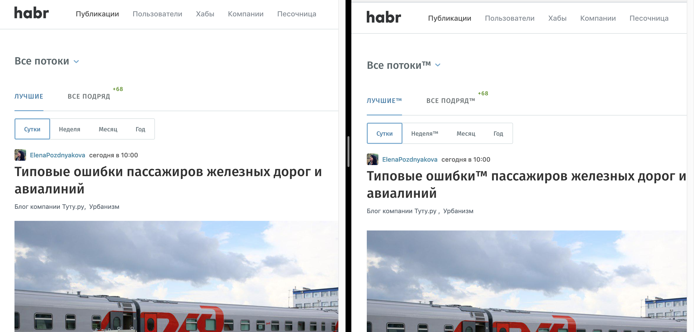

# Proxy server to http://habrahabr.ru

server gets html pages and added `™` to all words with 6 symbols

python3.7, aiohttp, bs4(for html parsing), pytest

### prepare

    $ docker build -t habra_proxy .

### Run app

    $ docker run -it --name habra_proxy \
       -p 8080:8080 \
       habra_proxy \
       python manage.py runserver

### Run tests
    
    $ ./run_tests.sh
